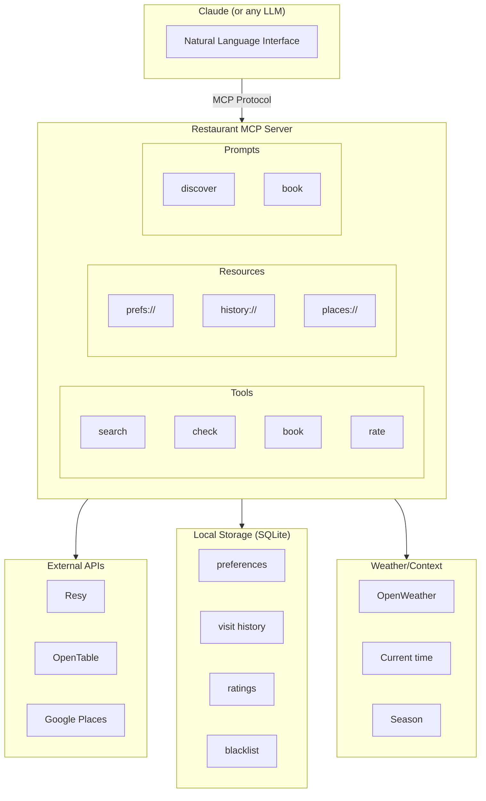
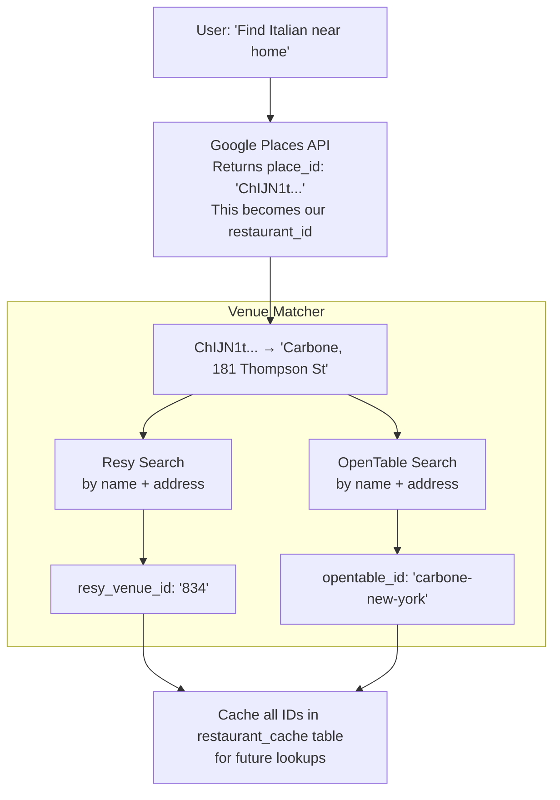
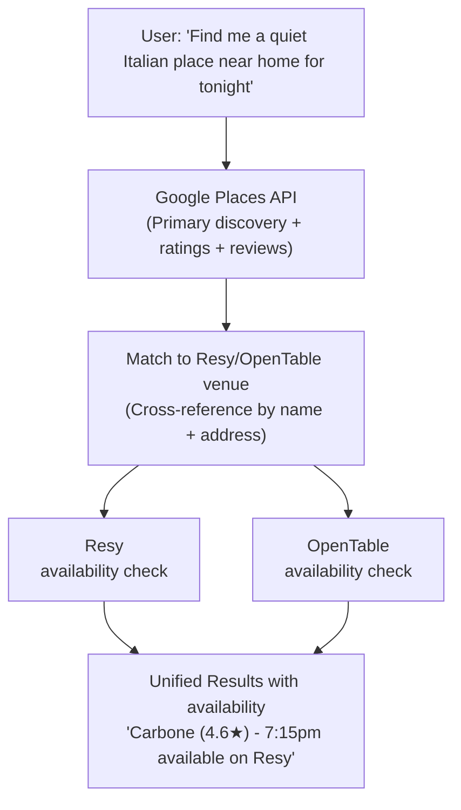

# NYC Restaurant Reservation Assistant - Architecture Plan

## Executive Summary

**Verdict: Feasible with caveats**

Building a personalized restaurant discovery and booking assistant is achievable. The critical insight from research is that while **no reservation platform offers an official consumer-facing booking API**, there are viable paths forward:

| Capability | Feasibility | Approach |
|------------|-------------|----------|
| **Discovery** | ✅ Easy | Google Places API |
| **Availability Check** | ✅ Possible | Reverse-engineered Resy API, OpenTable browser automation |
| **Booking** | ⚠️ Gray area | Resy unofficial API, OpenTable Playwright automation (personal use) |
| **Preference Storage** | ✅ Easy | Local SQLite → Cloud migration path |
| **Calendar Sync** | ✅ Easy | Google Calendar API |

### Key Risk: API Brittleness

The Resy unofficial API has a documented **3-6 month breakage cycle**. Anti-bot measures are escalating. Our architecture must include explicit fallback layers:

```
Primary:    API calls (Resy) → fastest, most reliable when working
Fallback 1: Playwright browser automation → slower but resilient to API changes
Fallback 2: Deep links → opens in user's browser as last resort
```

---

## Architecture Overview



---

## API Landscape & Strategy

### 1. Restaurant Discovery

**Primary: Google Places API**
- Comprehensive NYC coverage
- Rich metadata (ratings, price level, hours, photos)
- $17/1000 requests for Place Details
- Good for: Finding restaurants matching criteria, reviews, ratings
- Useful attributes: `ambience`, `noise_level`, `good_for_groups`

### 2. Reservation Systems

**Resy (Primary for NYC)**
Most high-end NYC restaurants use Resy. No official API, but well-documented unofficial endpoints:

```
Three-step booking flow (reverse-engineered):
1. GET  /4/find    → Returns available slots with config_id values
2. GET  /3/details → Returns book_token for a specific slot
3. POST /3/book    → With book_token + struct_payment_method completes reservation

Other endpoints:
- GET  /3/venue              → Restaurant details
- GET  /3/user/reservations  → Your bookings
- POST /3/auth/password      → Programmatic login (returns token, payment methods)

Authentication headers:
- Authorization: ResyAPI api_key="<key>"  (application-level)
- X-Resy-Auth-Token: <jwt>                (user-specific)
```

**API Brittleness Timeline:**
| Date | Issue |
|------|-------|
| June 2023 | Required valid browser User-Agent headers; bots returning HTTP 500 |
| Aug-Oct 2023 | "No longer available" errors on valid book_tokens |
| March 2024 | CAPTCHA increased; "Pardon Our Interruption" pages |
| April 2024 | Users unable to access api.resy.com at all |
| July 2025 | New issues still being opened on popular bot repos |

**Technical notes:**
- AmEx cardholders see additional inventory (AmEx owns Resy)
- Token refresh: hourly cron pattern (`1 * * * *`) recommended
- Known workaround: Converting booking POST to GET bypasses some CAPTCHA (fragile)

**OpenTable (Equal priority with Resy)**
- No consumer API available (Partner Program is business-only, 3-4 week approval)
- Browser automation via Playwright is the recommended approach
- Good coverage for mid-range restaurants (31.88% market share vs Resy's 12.75%)
- **Rate limiting is aggressive** — polling faster than 30s intervals gets blocked
- Mobile API exists (`mobile-api.opentable.com`) but less documented than Resy

**Resy vs OpenTable Comparison:**
| Factor | Resy | OpenTable |
|--------|------|-----------|
| Bot ecosystem | 10+ repos, 467 stars on lead | 3-4 repos, <30 stars |
| Auth complexity | API key + token from Network tab | Bearer token via mobile interception |
| Rate limiting | Minimal historically | Blocks at <30s intervals |
| CAPTCHA | Increasing since 2024 | None on mobile API |
| Market share (NYC) | ~12.75% (~8,975 restaurants) | ~31.88% (~22,437 restaurants) |

**Recommendation:** Build Resy first (easier, better documented), then OpenTable via Playwright.

### 3. Contextual Data

**Weather: OpenWeatherMap API**
- Free tier: 1000 calls/day
- Essential for: outdoor seating decisions

**Location Context**
- Store predefined locations (home, work) with coordinates
- Calculate walking distances via Google Distance Matrix API

### 4. Calendar Integration (Day-One Feature)

**Google Calendar API**
- Create events with location, confirmation details, cancellation links
- Generate ICS files for manual import (fallback)
- Links to Google Calendar, Outlook, Yahoo (like musemen/resy-mcp-server)

```python
async def add_to_calendar(reservation: Reservation) -> CalendarEvent:
    """Add confirmed reservation to user's Google Calendar."""
    event = {
        "summary": f"Dinner at {reservation.restaurant_name}",
        "location": reservation.address,
        "start": {"dateTime": reservation.datetime.isoformat()},
        "end": {"dateTime": (reservation.datetime + timedelta(hours=2)).isoformat()},
        "description": f"Party of {reservation.party_size}\nConfirmation: {reservation.confirmation_id}",
    }
    return await calendar_client.events().insert(calendarId="primary", body=event).execute()
```

---

## Data Model

Everything is stored in a single SQLite database (`data/restaurant.db`). Full schema in [EPIC-02-DATA-LAYER.md](./EPIC-02-DATA-LAYER.md) (Story 2.2).

### Key Tables

```sql
-- User preferences
user_preferences    -- name, rating_threshold, noise/formality/seating preferences
user_dietary        -- your dietary restrictions
cuisine_preferences -- favorite/avoid/neutral cuisines
price_preferences   -- acceptable price levels ($$, $$$, etc.)
locations           -- home, work with coordinates + walking radius

-- People & groups
people              -- dining companions with their preferences
people_dietary      -- their dietary restrictions
groups              -- named groups (work_team, family)
group_members       -- who's in each group

-- Visit history & reviews
visits              -- where you've been, when, party size
visit_reviews       -- would_return (binary), ambiance, noise_level
dish_reviews        -- what you ate, would_order_again
wine_reviews        -- wines ordered, would_order_again

-- System
restaurant_cache    -- cached Google Places data + Resy/OpenTable IDs
api_calls           -- logging for debugging + cost tracking
```

### Example Data

```sql
-- Your preferences
INSERT INTO user_preferences (id, name, rating_threshold, noise_preference)
VALUES (1, 'Devin', 4.0, 'moderate');

INSERT INTO user_dietary (restriction) VALUES ('no_red_meat');

INSERT INTO cuisine_preferences (cuisine, category) VALUES
  ('mexican', 'favorite'),
  ('mediterranean', 'favorite'),
  ('korean', 'favorite');

-- People you dine with
INSERT INTO people (name, no_alcohol, notes) VALUES
  ('Wife', 0, NULL),
  ('Nora', 1, 'Doesn''t drink'),
  ('David', 0, NULL),
  ('Behrooz', 0, NULL),
  ('Andrej', 0, NULL);

INSERT INTO people_dietary (person_id, restriction) VALUES
  (1, 'nut_allergy'),
  (1, 'seed_allergy');

-- Groups
INSERT INTO groups (name) VALUES ('work_team'), ('family');

INSERT INTO group_members (group_id, person_id) VALUES
  (1, 2), (1, 3), (1, 4), (1, 5),  -- work_team: Nora, David, Behrooz, Andrej
  (2, 1);                          -- family: Wife
```

CREATE TABLE blacklist (
    restaurant_id TEXT PRIMARY KEY,
    reason TEXT,
    added_date DATE
);
```

---

## Restaurant ID Strategy

### The Problem

We need a consistent way to identify restaurants across three systems:

| System | ID Type | Example |
|--------|---------|---------|
| Google Places | Place ID | `ChIJN1t_tDeuEmsRUsoyG83frY4` |
| Resy | Venue ID (numeric) | `834` |
| OpenTable | URL slug | `carbone-new-york` |

### Our Solution: Google Place ID as Canonical

**`restaurant_id` = Google Place ID** (used throughout our system)

```
restaurant_id: "ChIJN1t_tDeuEmsRUsoyG83frY4"  ← Canonical ID
├── resy_venue_id: "834"                      ← Cross-reference
└── opentable_id: "carbone-new-york"          ← Cross-reference
```

**Why Google Place ID?**

1. **Universal coverage** - Every restaurant has a Google Place ID
2. **Stable** - Doesn't change when restaurant updates their profile
3. **Rich metadata** - Links to ratings, reviews, hours, photos
4. **Discovery source** - We find restaurants via Google first

### ID Flow



### Where IDs Are Used

| Context | ID Used | Why |
|---------|---------|-----|
| `search_restaurants` returns | Google Place ID | Canonical reference |
| `visits` table | Google Place ID | Track history by restaurant |
| `check_availability` input | Restaurant name | Converted to platform ID internally |
| `make_reservation` internal | Resy/OpenTable ID | Required by platform APIs |
| `restaurant_cache` | Google Place ID (PK) + platform IDs | Cross-reference |

### Example Data

```sql
-- In restaurant_cache
INSERT INTO restaurant_cache (
    id,                              -- Google Place ID (canonical)
    name,
    address,
    resy_venue_id,                   -- Cross-reference
    opentable_id                     -- Cross-reference
) VALUES (
    'ChIJN1t_tDeuEmsRUsoyG83frY4',  -- restaurant_id
    'Carbone',
    '181 Thompson St, New York, NY',
    '834',                           -- Resy
    'carbone-new-york'               -- OpenTable
);

-- In visits table - uses canonical ID
INSERT INTO visits (restaurant_id, restaurant_name, ...)
VALUES ('ChIJN1t_tDeuEmsRUsoyG83frY4', 'Carbone', ...);
```

---

## MCP Best Practices

Based on research (Philipp Schmid, Jan 2026): **MCP is a user interface for AI agents, not a REST API wrapper.**

### Design Principles

1. **Design for outcomes, not operations.** Don't expose separate `search_restaurants()`, `get_availability()`, `make_reservation()`. Instead, expose `find_and_book_restaurant()` that orchestrates internally.

2. **Flatten arguments to primitives and enums.** Use `Literal` types for constrained choices (cuisine types, price ranges). Minimize decisions Claude needs to make.

3. **Treat docstrings as instructions.** Tool docstrings are Claude's primary understanding — make them detailed with examples and edge cases.

4. **Curate ruthlessly.** Keep to **5-15 tools per server**. Our architecture target: ~12 tools.

5. **Name tools with service-prefix pattern.** Use `resy_search`, `opentable_check` for disambiguation.

6. **Paginate large results.** Restaurant searches return manageable subsets with pagination.

### Framework: FastMCP

Use FastMCP (`gofastmcp.com`) — auto-generates tool names from function names, descriptions from docstrings, JSON schemas from type hints:

```python
from fastmcp import FastMCP

mcp = FastMCP("restaurant-assistant")

@mcp.tool()
async def find_and_book_restaurant(
    cuisine: list[str] | None = None,
    location: str = "home",
    party_size: int = 2,
    date: str = "today",
    time: str = "19:00",
) -> BookingResult:
    """
    Find restaurants matching criteria and book if user confirms.

    Automatically applies user dietary restrictions and preferences.
    Checks both Resy and OpenTable for availability.
    Returns ranked options with time slots.
    """
    ...
```

---

## MCP Server Tools

### Core Tools

```python
@mcp.tool()
async def search_restaurants(
    cuisine: Optional[List[str]] = None,
    location: str = "home",  # "home", "work", or address
    party_size: int = 2,
    date: str = "today",
    time: str = "19:00",
    ambience: Optional[str] = None,  # "quiet", "lively"
    outdoor_ok: bool = False,
    max_results: int = 5
) -> List[Restaurant]:
    """
    Search for restaurants matching criteria.
    Automatically applies user preferences and filters.
    Returns ranked list with availability status.
    """

@mcp.tool()
async def check_availability(
    restaurant_id: str,
    party_size: int,
    date: str,
    preferred_time: str,
    flexibility_minutes: int = 60
) -> AvailabilityResult:
    """
    Check reservation availability at specific restaurant.
    Returns available time slots within flexibility window.
    """

@mcp.tool()
async def make_reservation(
    restaurant_id: str,
    party_size: int,
    date: str,
    time: str,
    special_requests: Optional[str] = None
) -> ReservationConfirmation:
    """
    Book a reservation. Requires user confirmation before executing.
    Returns confirmation number and details.
    """

@mcp.tool()
async def rate_visit(
    restaurant_id: str,
    rating: int,  # 1-5
    would_return: bool,
    notes: Optional[str] = None
) -> None:
    """
    Record feedback about a restaurant visit.
    Used to improve future recommendations.
    """

@mcp.tool()
async def get_recommendations(
    occasion: Optional[str] = None,  # "date_night", "team_dinner", "casual"
    party_size: int = 2,
    location: str = "home",
    exclude_recent_days: int = 14
) -> List[Restaurant]:
    """
    Get personalized recommendations based on history and preferences.
    Automatically excludes recently visited and blacklisted restaurants.
    """
```

### Utility Tools

```python
@mcp.tool()
async def update_preferences(
    category: str,  # "dietary", "cuisine", "ambience", "locations"
    updates: dict
) -> None:
    """Update user preferences."""

@mcp.tool()
async def add_to_blacklist(
    restaurant_id: str,
    reason: str
) -> None:
    """Never recommend this restaurant again."""

@mcp.tool()
async def log_external_visit(
    restaurant_name: str,
    cuisine: str,
    date: str,
    rating: Optional[int] = None
) -> None:
    """Manually log a visit not booked through the system."""

@mcp.tool()
async def manage_person(
    name: str,
    action: str = "add",  # "add", "update", "remove"
    dietary: Optional[List[str]] = None,
    preferences: Optional[dict] = None,
    notes: Optional[str] = None
) -> None:
    """
    Manage people profiles for group dining.
    Example: add_person("nora", dietary=[], preferences={"no_alcohol": true}, notes="Doesn't drink")
    """

@mcp.tool()
async def manage_group(
    group_name: str,
    action: str = "add",  # "add", "update", "remove"
    members: Optional[List[str]] = None
) -> None:
    """
    Manage predefined groups.
    Example: manage_group("work_team", members=["nora", "david", "behrooz", "andrej"])
    """

@mcp.tool()
async def search_for_group(
    group_name: str,
    location: str = "work",
    date: str = "today",
    time: str = "18:00",
    cuisine: Optional[List[str]] = None
) -> List[Restaurant]:
    """
    Search restaurants suitable for a predefined group.
    Automatically merges all member dietary restrictions.
    """
```

---

## Implementation Phases (Revised)

### Phase 1: Foundation (Week 1-2)
**Goal: Working MCP with discovery, preferences, and people/groups**

- [ ] Set up Python MCP server skeleton
- [ ] Implement local SQLite storage
- [ ] Integrate Google Places API for discovery + reviews
- [ ] Build preference loading/saving (including people and groups)
- [ ] Create `search_restaurants` tool (discovery only)
- [ ] Create `manage_person` and `manage_group` tools
- [ ] Test with Claude

**Deliverable:** Can ask "Find me Italian restaurants near my home" and get results with Google ratings

### Phase 2: Resy + OpenTable Integration (Week 3-4)
**Goal: Check availability and book via both Resy AND OpenTable with automated auth**

- [ ] Build Playwright-based Resy auth automation
- [ ] Build Playwright-based OpenTable auth automation
- [ ] Implement secure credential storage (both platforms)
- [ ] Build venue matching (Google Place → Resy/OpenTable ID)
- [ ] Implement `check_availability` for both platforms
- [ ] Implement `make_reservation` for both platforms
- [ ] Add reservation confirmation flow
- [ ] Handle auth refresh when tokens expire

**Deliverable:** Can ask "Book me a table at Carbone for Saturday" and have it reserved - regardless of whether restaurant uses Resy or OpenTable

> **Why both?** Resy + OpenTable cover ~90% of NYC online reservations. Single-platform coverage would leave half your restaurants unbookable.

### Phase 3: Intelligence Layer (Week 5-6)
**Goal: Smart recommendations and context awareness**

- [ ] Integrate weather API for outdoor decisions
- [ ] Build recommendation engine using visit history + reviews
- [ ] Add "recency penalty" (don't suggest Mexican if had it yesterday)
- [ ] Implement `search_for_group` with merged dietary restrictions
- [ ] Add seasonal awareness (no outdoor in winter)
- [ ] Implement `get_dish_recommendations` for returning visits

**Deliverable:** Contextual suggestions that learn from your review history

### Phase 4: Polish & Production (Week 7-8)
**Goal: Robustness, learning, and reliability**

- [ ] Build preference learning from ratings
- [ ] Add favorite restaurant shortcuts
- [ ] Robust error handling across platforms
- [ ] Token refresh monitoring and notifications
- [ ] Review sentiment analysis for ambience keywords
- [ ] Performance optimization (caching, parallel lookups)

**Deliverable:** Production-ready personal tool

---

## Technical Implementation Details

### Project Structure

> **Full canonical structure** with every file listed is in `.ai/ENGINEERING-STANDARDS.md` Section 1.

```
restaurant-mcp/
├── .ai/
│   ├── AGENTS.md               # Agent instructions (system prompt for AI engineers)
│   └── ENGINEERING-STANDARDS.md # Code patterns, architecture rules, testing mandate
├── docs/
│   ├── specs/                  # EPICs, architecture plan, research
│   └── adr/                    # Architecture Decision Records
├── scripts/
│   ├── validate.sh             # Full pipeline: lint + typecheck + test + coverage
│   ├── test.sh                 # Run tests with coverage
│   └── lint.sh                 # Ruff linting only
├── src/
│   ├── server.py               # MCP server entry point
│   ├── config.py               # pydantic-settings configuration
│   ├── tools/                  # MCP tool definitions
│   │   ├── preferences.py, people.py, search.py, booking.py
│   │   ├── history.py, recommendations.py, date_utils.py, error_messages.py
│   ├── clients/                # External API clients
│   │   ├── base.py, google_places.py, cuisine_mapper.py
│   │   ├── resy.py, resy_auth.py, opentable.py
│   │   ├── weather.py, calendar.py, cache.py, resilience.py
│   ├── storage/
│   │   ├── database.py, schema.sql, credentials.py
│   ├── matching/
│   │   └── venue_matcher.py    # Google Place → Resy/OpenTable ID
│   └── models/
│       ├── enums.py, restaurant.py, user.py, reservation.py, review.py
├── tests/                      # Mirrors src/ — see ENGINEERING-STANDARDS.md
├── data/                       # Runtime (gitignored): restaurant.db, logs/, .credentials/
├── pyproject.toml
├── .env.example
├── .gitignore
└── README.md
```

### Key Dependencies

```toml
[project]
dependencies = [
    "fastmcp>=0.1.0",          # FastMCP framework (replaces raw MCP SDK)
    "httpx>=0.25.0",           # Async HTTP client
    "aiosqlite>=0.19.0",       # Async SQLite
    "pydantic>=2.0.0",         # Data validation
    "python-dotenv>=1.0.0",    # Environment management
    "playwright>=1.40.0",      # Browser automation for auth + OpenTable
    "cryptography>=41.0.0",    # Fernet credential encryption
    "googlemaps>=4.10.0",      # Google Places API
    "google-api-python-client>=2.0.0",  # Google Calendar API
    "tenacity>=8.0.0",         # Retry with exponential backoff
    "pybreaker>=1.0.0",        # Circuit breaker pattern
]
```

### Resy Client Example

```python
class ResyClient:
    BASE_URL = "https://api.resy.com"

    def __init__(self, api_key: str, auth_token: str):
        self.api_key = api_key
        self.auth_token = auth_token
        self.client = httpx.AsyncClient(headers={
            "Authorization": f'ResyAPI api_key="{api_key}"',
            "X-Resy-Auth-Token": auth_token,
            "X-Resy-Universal-Auth": auth_token,
        })

    async def find_availability(
        self,
        venue_id: str,
        date: str,
        party_size: int
    ) -> List[TimeSlot]:
        response = await self.client.get(
            f"{self.BASE_URL}/4/find",
            params={
                "venue_id": venue_id,
                "day": date,
                "party_size": party_size,
                "lat": 0,
                "long": 0,
            }
        )
        return self._parse_slots(response.json())

    async def book(
        self,
        config_id: str,  # From availability response
        party_size: int,
        date: str,
        payment_method_id: Optional[str] = None
    ) -> Reservation:
        # Get booking token first
        details = await self._get_booking_details(config_id, date, party_size)

        # Execute booking
        response = await self.client.post(
            f"{self.BASE_URL}/3/book",
            json={
                "book_token": details["book_token"],
                "struct_payment_method": payment_method_id,
                "source_id": "resy.com-venue-details"
            }
        )
        return Reservation.from_response(response.json())
```

---

## Multi-Platform Strategy

Based on Devin's input: restaurants split across Resy, OpenTable, and Google Maps for discovery/reviews.

### Unified Search Flow



### Google Maps as Quality Signal

- Use Google Places API `reviews` and `rating` as primary quality indicator
- Resy/OpenTable ratings are supplementary
- Extract review sentiment for ambience keywords ("quiet", "romantic", "loud")

---

## Automated Authentication

### Resy Auth Automation (via Playwright)

Yes, we can automate Resy login! Here's the approach:

```python
from playwright.async_api import async_playwright

class ResyAuthManager:
    """Automates Resy login to extract auth tokens."""

    async def get_fresh_token(self, email: str, password: str) -> dict:
        async with async_playwright() as p:
            browser = await p.chromium.launch(headless=True)
            context = await browser.new_context()
            page = await context.new_page()

            # Capture API requests to extract token
            tokens = {}
            async def capture_token(request):
                if "api.resy.com" in request.url:
                    headers = request.headers
                    if "x-resy-auth-token" in headers:
                        tokens["auth_token"] = headers["x-resy-auth-token"]
                    # Extract api_key from URL
                    if "api_key=" in request.url:
                        tokens["api_key"] = request.url.split("api_key=")[1].split("&")[0]

            page.on("request", capture_token)

            # Navigate and login
            await page.goto("https://resy.com/login")
            await page.fill('input[name="email"]', email)
            await page.fill('input[name="password"]', password)
            await page.click('button[type="submit"]')

            # Wait for authenticated request
            await page.wait_for_timeout(3000)
            await page.goto("https://resy.com")  # Trigger API call

            await browser.close()
            return tokens

    async def refresh_if_expired(self) -> bool:
        """Check if current token works, refresh if not."""
        try:
            # Test current token with a simple API call
            await self.client.get_user_profile()
            return False  # No refresh needed
        except AuthError:
            # Refresh tokens
            new_tokens = await self.get_fresh_token(
                self.credentials["email"],
                self.credentials["password"]
            )
            self.save_tokens(new_tokens)
            return True
```

### Credential Storage

```python
# Store credentials encrypted at rest
from cryptography.fernet import Fernet

class SecureCredentialStore:
    def __init__(self, key_path: str):
        self.cipher = Fernet(self._load_or_create_key(key_path))

    def save_credentials(self, platform: str, email: str, password: str):
        encrypted = self.cipher.encrypt(
            json.dumps({"email": email, "password": password}).encode()
        )
        # Save to secure location

    def get_credentials(self, platform: str) -> dict:
        # Decrypt and return
```

### OpenTable Auth

OpenTable requires browser automation (Partner API is business-only, not available for consumers):
- Browser automation via Playwright with your credentials
- May need to handle CAPTCHAs occasionally
- Use realistic delays between actions to avoid detection

---


| Risk | Impact | Mitigation |
|------|--------|------------|
| Resy auth tokens expire | High | Build token refresh flow; hourly cron pattern |
| Resy API breakage (3-6 month cycle) | High | Fallback layers: API → Playwright → deep links |
| OpenTable bot detection | Medium | Playwright automation; >30s between requests |
| Account deactivation | Medium | Personal use only; avoid commercial patterns |
| Google Places API costs | Low | Cache aggressively (24hr TTL for metadata) |
| Weather API rate limits | Low | Cache daily; free tier sufficient for personal use |

---

## Legal Considerations

### NY Restaurant Reservation Anti-Piracy Act (S.9365A)

Effective February 17, 2025, this law prohibits third-party services from listing, advertising, or selling restaurant reservations without written restaurant agreements.

**Penalties:** $1,000 per violation per day. Private right of action for both consumers and restaurants.

**Similar laws:** Florida (SB 940, July 2025), proposed in CA, IL, LA, HI, NV.

**For this project:**
- Personal-use automation is **not explicitly prohibited**
- Commercial deployment or multi-user service introduces significant legal risk
- Both Resy's and OpenTable's ToS prohibit automated access regardless of legal status
- Account deactivation is a real risk

---

## Error Handling & Resilience

### Fallback Layer Strategy

```python
class ResilientBookingClient:
    async def book(self, restaurant_id: str, params: BookingParams) -> BookingResult:
        # Layer 1: Direct API (fastest)
        try:
            return await self._book_via_api(restaurant_id, params)
        except (APIUnavailable, SchemaChanged, RateLimited):
            pass

        # Layer 2: Playwright browser automation (slower but resilient)
        try:
            return await self._book_via_playwright(restaurant_id, params)
        except (CAPTCHARequired, BotDetected):
            pass

        # Layer 3: Deep link (opens in user's browser)
        return BookingResult(
            status="manual_required",
            deep_link=self._generate_deep_link(restaurant_id, params),
            message="Please complete booking in browser"
        )
```

### Error Classification

| Error Type | HTTP Codes | Strategy |
|------------|------------|----------|
| **Transient** | 429, 500, 502, 503, 504 | Retry with exponential backoff + jitter |
| **Permanent** | 400, 401, 403, 404 | Don't retry; handle gracefully |
| **Schema change** | 200 with unexpected structure | Log, alert, fall back to Playwright |

### Circuit Breaker Pattern

```python
from pybreaker import CircuitBreaker

resy_breaker = CircuitBreaker(
    fail_max=5,           # Open after 5 failures
    reset_timeout=60,     # Try again after 60s
)

@resy_breaker
async def call_resy_api(endpoint: str, **params):
    ...
```

### Three-Tier Caching

| Tier | Storage | TTL | Use Case |
|------|---------|-----|----------|
| Hot | In-memory LRU | Session | Current conversation context |
| Warm | SQLite | 24 hours | Restaurant metadata (name, location, cuisine) |
| Cold | Live API | 5-15 min | Availability data (must be fresh) |

Implement **cache-aside with stale fallback**: if API fails, serve stale cached availability with disclaimer.

---

## Getting Started

### Prerequisites
1. Python 3.11+
2. Google Cloud account (for Places API key)
3. Resy account (for credentials extraction)

### Extracting Resy Credentials
1. Log into resy.com in Chrome
2. Open DevTools → Network tab
3. Navigate to any restaurant page
4. Find a request to `api.resy.com`
5. Copy `api_key` from query params
6. Copy `x-resy-auth-token` from headers

### First Run
```bash
# Clone and setup
cd restaurant-mcp
python -m venv venv
source venv/bin/activate
pip install -e .

# Configure
cp .env.example .env
# Edit .env with your API keys

# Run MCP server
python -m src.server
```

### Claude Desktop Integration
Add to `~/.claude/claude_desktop_config.json`:
```json
{
  "mcpServers": {
    "restaurant": {
      "command": "python",
      "args": ["-m", "src.server"],
      "cwd": "/path/to/restaurant-mcp"
    }
  }
}
```

---

## Open Questions for Devin

~~1. **Resy vs OpenTable priority**: Most of your target restaurants on Resy? Should we focus there first?~~
**ANSWERED**: Mix of both + Google Maps for reviews. Building multi-platform from start. Research confirms: Resy first (easier), then OpenTable.

~~2. **Team dinner handling**: For "book for my team of 5", should I just use your preferences, or should we build a way to specify different group preferences?~~
**ANSWERED**: Save named people (Nora, David, etc.) with their preferences, compose into groups.

~~3. **Auth management**: Comfortable with periodically re-extracting Resy tokens, or should we invest in automating that?~~
**ANSWERED**: Automate via Playwright browser automation with stored credentials. Research confirms: hourly cron pattern for token refresh.

~~4. **Notification preferences**: Want SMS/email confirmations, or is seeing it in Claude sufficient?~~
**ANSWERED**: Not needed - Resy/OpenTable send their own confirmations. Calendar integration added instead.

~~5. **Calendar integration**: Should we add reservations to Google Calendar?~~
**ANSWERED**: Yes — research indicates this should be a day-one feature. Implemented.

~~6. **OpenTable approach**: Should we apply for the Partner API (takes 3-4 weeks), or start with browser automation?~~
**ANSWERED**: Browser automation only (Partner API is business-only, not available for consumers).

### Remaining Questions

7. **Budget**: Any constraints on API costs? Google Places can add up with heavy usage (~$17/1000 detailed lookups).

---

## Reference Implementations

### Key GitHub Repositories

| Repository | Stars | Language | What It Does |
|-----------|-------|----------|-------------|
| `Alkaar/resy-booking-bot` | 467 | Scala | Seminal Resy sniper; sleeps until drop time |
| `korbinschulz/resybot-open` | 38 | Python | Former SaaS with CAPTCHA bypass via GET trick |
| `21Bruce/resolved-bot` | 46 | Go | CLI with `rats` (snipe at time) and `rais` (polling) modes |
| `jeffknaide/resy-bot` | 14 | Python | Clean Pydantic-modeled Resy API wrapper |
| `musemen/resy-mcp-server` | — | Python | Full MCP server with encrypted storage, scheduling |
| `jrklein343-svg/restaurant-mcp` | — | TypeScript | Unified Resy+OpenTable MCP with snipe tool |
| `jonluca/OpenTable-Reservation-Maker` | 7 | Python | Mobile API reverse-engineering |
| `nohren/Open-Table-Bot` | 20 | JS | Tampermonkey userscript + Node.js alerts |
| `samwang0723/mcp-booking` | 9 | TypeScript | Google Maps discovery MCP (mock booking) |
| `agupta01/resy-mcp` | — | Python | PyPI-published lightweight Resy MCP |

---

## Sources

### Resy Resources
- [Resy Booking Bot (GitHub)](https://github.com/Alkaar/resy-booking-bot) - Scala bot, 467 stars, seminal implementation
- [Resy CLI](https://github.com/lgrees/resy-cli) - Command-line interface for Resy
- [Reversing Resy's API (JonLuca)](https://jonluca.substack.com/p/resy-api) - Detailed API reverse engineering (2022)
- [jeffknaide/resy-bot](https://github.com/jeffknaide/resy-bot) - Clean Pydantic models for Resy API

### OpenTable Resources
- [OpenTable-Reservation-Maker (GitHub)](https://github.com/jonluca/OpenTable-Reservation-Maker) - Mobile API approach
- [Open-Table-Bot by nohren](https://github.com/nohren/Open-Table-Bot) - Gets reservations when others cancel
- [resolved-bot](https://github.com/21Bruce/resolved-bot) - Multi-platform bot (Go)

### OpenTable Technical Notes

OpenTable mobile API (`mobile-api.opentable.com`) four-step flow:
1. `PUT /api/v3/restaurant/availability` — check availability (with `availabilityToken` JWT)
2. `POST /api/v1/reservation/<id>/lock` — lock a slot
3. `POST /api/v1/reservation/<id>` — complete booking
4. `DELETE /api/v3/reservation/<id>/<confirmation>` — cancel

**Recommended approach:** Playwright browser automation (more maintainable than mobile API reverse-engineering given thin community documentation).

### MCP Resources
- [MCP Best Practices (Philipp Schmid, Jan 2026)](https://philschmid.de/mcp-servers) — "MCP is Not the Problem, It's Your Server"
- [FastMCP Documentation](https://gofastmcp.com) — Python MCP framework
- [Thoughtworks Tech Radar Vol. 33](https://www.thoughtworks.com/radar) — warns against "naive API-to-MCP conversion"

### General
- [Restaurant Reservation System Comparison](https://sevenrooms.com/blog/restaurant-reservation-system-comparison-guide/)
